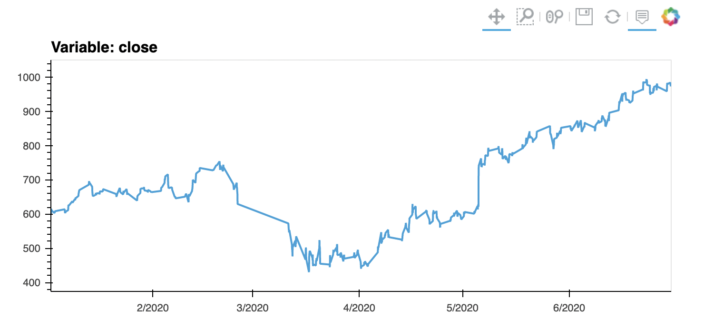
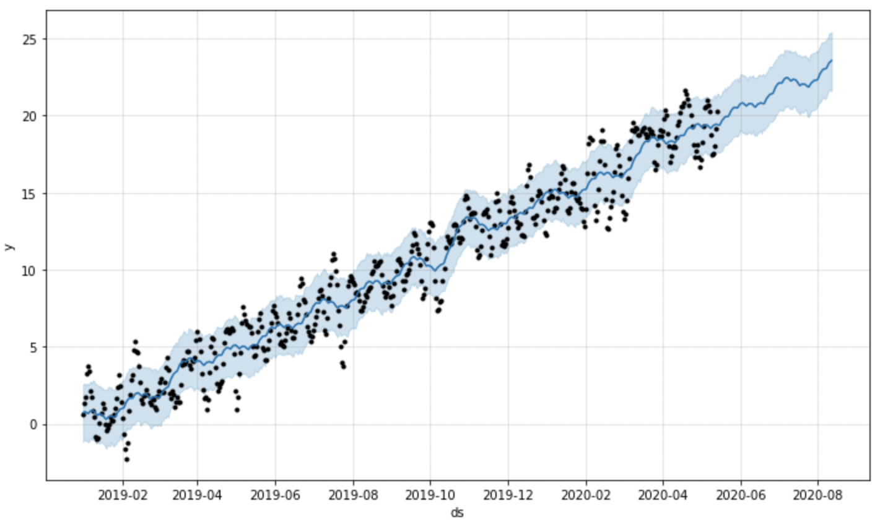

# Growth Analysis of MercadoLibre, an e-commerce site in Latin America

---

This Jupyter notebook application uses hourly Google search for discovery of correlations with MercadoLibre reporting events, seasonality, stock price and volatility. A Facebook Prophet time series model is created to examine the individual time series components of the model and predict search trends for the next quarter. Finally, a forecast of sales revenue for the next quarter is prepared, including best and worst case scenarios. 

## *Technologies*
This application is written using Python 3.9.7 and uses historical Google search and closing stock price data for MercadoLibre. Time series modeling is performed using Facebook Prophet. Interactive line plots and visualizations are created using the PyViz hvplot.

## *Installation Guide*
Install the pandas, pystan, holoviews, numpy, fbprophet and datetime libraries.

## *Usage*
Run the program from Jupyter notebook as 'forecasting_net_prophet.ipynb'.

## *Contributors*
This program was written by David Hockenbery with the assistance of the UW FinTech class of 2021 and instructors. Contact David at dhockenb@gmail.com.

## *License*
opyright (c) [2022] [David Hockenbery]

Permission is hereby granted, free of charge, to any person obtaining a copy
of this software and associated documentation files (the "Software"), to deal
in the Software without restriction, including without limitation the rights
to use, copy, modify, merge, publish, distribute, sublicense, and/or sell
copies of the Software, and to permit persons to whom the Software is
furnished to do so, subject to the following conditions:

The above copyright notice and this permission notice shall be included in all
copies or substantial portions of the Software.

THE SOFTWARE IS PROVIDED "AS IS", WITHOUT WARRANTY OF ANY KIND, EXPRESS OR
IMPLIED, INCLUDING BUT NOT LIMITED TO THE WARRANTIES OF MERCHANTABILITY,
FITNESS FOR A PARTICULAR PURPOSE AND NONINFRINGEMENT. IN NO EVENT SHALL THE
AUTHORS OR COPYRIGHT HOLDERS BE LIABLE FOR ANY CLAIM, DAMAGES OR OTHER
LIABILITY, WHETHER IN AN ACTION OF CONTRACT, TORT OR OTHERWISE, ARISING FROM,
OUT OF OR IN CONNECTION WITH THE SOFTWARE OR THE USE OR OTHER DEALINGS IN THE
SOFTWARE.
